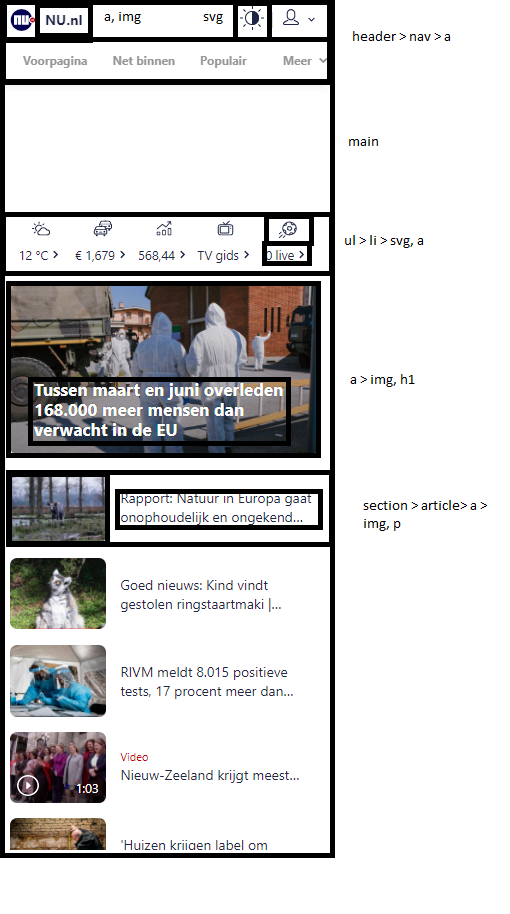
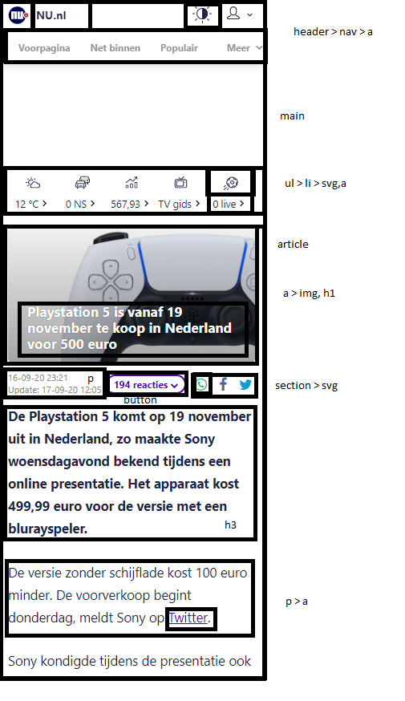
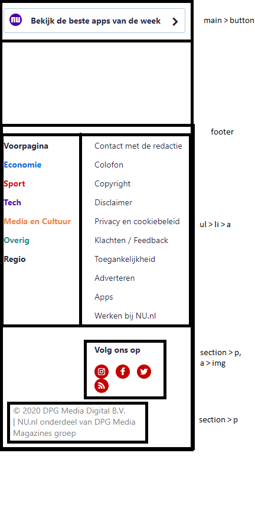

# Procesverslag
**Auteur:** Akshay Kumar

Markdown cheat cheet: [Hulp bij het schrijven van Markdown](https://github.com/adam-p/markdown-here/wiki/Markdown-Cheatsheet). Nb. de standaardstructuur en de spartaanse opmaak zijn helemaal prima. Het gaat om de inhoud van je procesverslag. Besteedt de tijd voor pracht en praal aan je website.

## Bronnenlijst
1. https://www.nu.nl/
2. https://www.w3schools.com/
3. -...-

## Intake (week 1)

**Je startniveau:** Blauw-Rood

**Je focus:** Uiteindelijk wel beide, omdat ik het mij wel interessant en uitdagend lijkt om met beide aan de slag te gaan.

**Je opdracht:** Wat ik zou willen is de Nu.nl website namaken, als het me lukt ook een beetje responsive voor de uitdaging. De nadruk ligt echter wel op het namaken.

De pagina's:

- De homepage
- De artikelpagina

**Screenshot(s):**

**Breakdown-schets(en):**

## Voortgang 1 (week 3)

### Stand van zaken

Wat ging goed:
de HTML elementen gingen goed opzich en soms wat moeite met het positioning van de elementen(dus bedenken van of flexbox gebruiken of grid)

**Screenshot(s):**

-screenshot(s) van hoe ver je bent-

### Agenda voor meeting

-samen met je groepje opstellen-

### Verslag van meeting

-na afloop snel uitkomsten vastleggen-

## Voortgang 2 (week 5)

-same as voortgang 1-

## Voortgang 3 (week 6)

-same as voortgang 1-

## Eindgesprek (week 7/8)

-dit ging goed & dit was lastig-

**Screenshot(s):**

-screenshot(s) van je eindresultaat-

